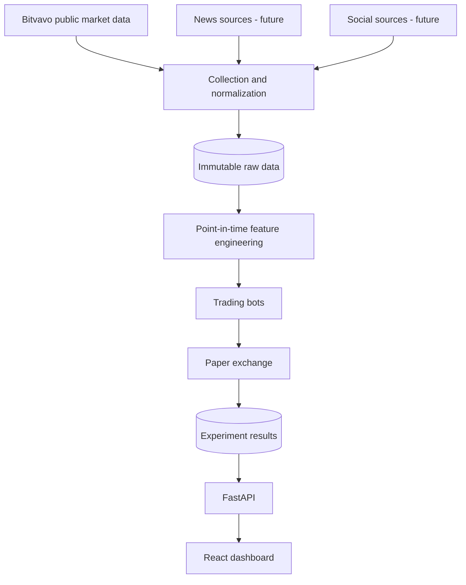

# AI Paper Trading Platform

A professional research foundation for comparing AI/ML/RL crypto trading strategies under identical historical and live market conditions.

> **Paper trading only.** This project does not execute real trades and is not financial advice. It contains no real-order endpoint, and bots cannot access exchange credentials.

## Goals

- Capture and normalize real-time and historical crypto market data.
- Preserve immutable raw data and build point-in-time-safe features.
- Run multiple independent bots against a deterministic paper exchange.
- Reproduce and compare backtests and live paper experiments.
- Later enrich observations with news and social sentiment.
- Monitor results through an API and dashboard.

No trading strategies, AI models, or exchange integrations are implemented yet.

## Architecture



The system is a modular monolith. Bots consume normalized `MarketState` values and produce `BotAction` intents. Only the paper exchange handles virtual execution. See [architecture](docs/architecture.md), [bot interface](docs/bot-interface.md), and [data model](docs/data-model.md).

## Repository structure

- `backend/`: FastAPI, domain contracts, async persistence foundation, and tests.
- `frontend/`: minimal React/TypeScript/Vite dashboard foundation.
- `database/`: Alembic migration location and persistence notes.
- `data/`: ignored local raw and processed datasets.
- `models/`: ignored local model artifacts and storage guidance.
- `docs/`: architecture, development, security, data, and roadmap decisions.
- `scripts/`: cross-platform bootstrap scripts.

## Technology

Python 3.12, FastAPI, Pydantic, SQLAlchemy asyncio, PostgreSQL, Alembic, pytest, Ruff, and mypy; React, TypeScript, Vite, ESLint, and Vitest; Redis for future queues/cache/pub-sub.

## Local setup

Prerequisites: Python 3.12+, Node.js 24 LTS, npm, and Docker Compose. The current
frontend also remains compatible with Node.js 20.19+ for local development.

```bash
cp .env.example .env
./scripts/setup.sh
docker compose up -d
```

On PowerShell:

```powershell
Copy-Item .env.example .env
.\scripts\setup.ps1
docker compose up -d
```

The checked-in database password is development-only. Replace credentials and use managed secrets for any deployed environment. Bitvavo, news, and social credentials are optional; public market data and paper trading must not need trading credentials.

## Run

Backend, from `backend/` with the virtual environment active:

```bash
uvicorn app.main:app --reload
```

`GET http://localhost:8000/health` returns `{"status":"healthy"}`.

Frontend, from `frontend/`:

```bash
npm run dev
```

PostgreSQL and Redis bind only to localhost. Stop them with `docker compose down`; named volumes preserve local state.

## Quality checks

```bash
cd backend
ruff check .
ruff format --check .
mypy .
pytest

cd ../frontend
npm run lint
npm run typecheck
npm test
npm run build
```

CI runs the same checks. The backend test command enforces 80% branch coverage.

## Development and experiments

Use `feature/*` → `dev` → `main`; details and recommended GitHub rules are in [development](docs/development.md). Experiments should record bot/strategy/model versions, balance and time window, market/universe, configuration, metrics, feature/training-data versions, hyperparameters, seed, and commit. Outputs must point to versioned artifacts by URI/checksum rather than committing large files.

## Data and security

Raw captures are immutable; processed data is separately versioned and reproducible. Simulation clocks and availability timestamps prevent future information from entering backtests. Never commit market dumps, model binaries, checkpoints, logs, database dumps, or secrets. Full rules are in [data model](docs/data-model.md) and [security](docs/security.md).

## Roadmap

The next milestone is a read-only Bitvavo market-data adapter and normalized persistence. Later milestones cover paper execution, bot runtimes, backtesting, experiment comparison, text features, and the dashboard. See the complete [roadmap](docs/roadmap.md).

## License

[MIT](LICENSE)
