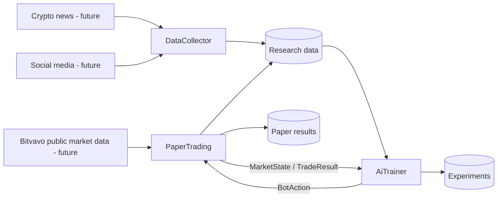

# PaperTradeAiTrainer

A modular research platform for collecting crypto context, simulating virtual trading, and training/comparing AI trading agents under reproducible market conditions.

> **Paper trading only.** This repository cannot execute real trades and is not financial advice. It has no real-order interface, and bots never receive exchange credentials.

## Architecture



The repository is one deployable-by-choice monorepo with strong logical boundaries:

- **DataCollector** asks what is happening outside the market. It will acquire and normalize news/social data while preserving immutable raw input.
- **PaperTrading** asks what is happening in the market and what a virtual execution would do. It owns public market data and the paper-only exchange boundary.
- **AiTrainer** asks what a bot should decide and how well it performs. It owns bots, training, backtesting, evaluation, and experiments.
- **shared** defines the small, framework-neutral language those projects use to communicate.
- **frontend** remains the future React monitoring dashboard.

Each Python project follows pragmatic Clean Architecture: interfaces and infrastructure depend on application/domain, while application defines ports and domain remains framework-free. Projects do not import one another's internals. See [architecture overview](docs/architecture/overview.md).

## Repository map

```text
DataCollector/    external text acquisition and normalization
PaperTrading/     market observations and virtual execution
AiTrainer/        bots, training, backtesting, evaluation
shared/           inter-project contracts only
tests/            architecture, contract, and end-to-end tests
validation/       trust checks for boundaries/environment/system
data/             ignored local raw/normalized/feature data
models/           ignored model artifacts
experiments/      versioned configs; ignored results/reports
database/         Alembic migration foundation
frontend/         React/TypeScript/Vite dashboard foundation
docs/             architecture, data, and development guidance
```

## Setup

Requirements: Python 3.12+, Node.js 24 LTS, npm, and Docker Compose.

```powershell
Copy-Item .env.example .env
.\scripts\setup.ps1
docker compose up -d
```

POSIX shells can use `cp .env.example .env` and `./scripts/setup.sh`. PostgreSQL and Redis bind only to localhost and use obvious development-only credentials.

Run the PaperTrading status API:

```powershell
.\.venv\Scripts\Activate.ps1
uvicorn paper_trading.interfaces.api:app --reload
```

`GET /health` returns `{"status":"healthy","trading_mode":"paper"}`. Run the dashboard with `npm run dev --prefix frontend`.

## Tests and validation

```powershell
.\scripts\test.ps1
.\scripts\test.ps1 -m unit
.\scripts\test.ps1 -m "not slow"
.\scripts\validate.ps1
```

Tests verify expected software behavior. Validation checks whether actual data, configuration, contracts, or system state can be trusted. Project-local tests stay with each owner; root tests cover cross-project compatibility. Details are in [testing](docs/development/testing.md) and [validation](docs/development/validation.md).

Quality checks:

```powershell
ruff check .
ruff format --check .
mypy
pytest
npm run lint --prefix frontend
npm run typecheck --prefix frontend
npm test --prefix frontend
npm run build --prefix frontend
```

## Data and ML safety

Raw data is immutable. The pipeline is raw → normalized → features → training/backtesting. At time T, bots see only information available at or before T. External text retains `published_at`, `received_at`, and `processed_at`; training uses chronological splits and training-only normalization statistics. See [data pipeline](docs/data/data-pipeline.md), [timestamps](docs/data/timestamps.md), and [leakage prevention](docs/data/leakage-prevention.md).

Generated datasets, model binaries, experiment results, logs, database dumps, and secrets are ignored. Store large artifacts in versioned local/object storage with checksums and provenance. Heavy dependencies such as PyTorch, TensorFlow, Stable-Baselines3, Transformers, and XGBoost are intentionally absent.

## Security

`.env` is ignored; `.env.example` contains placeholders only. Public market data and paper trading must not require trading-enabled credentials. Never log secrets or expose `BITVAVO_API_SECRET` to bots. Any future real-trading capability would require a separately reviewed architecture and does not belong in PaperTrading.

CodeQL, Dependabot, per-project CI, architecture CI, frontend CI, pre-commit, and repository templates are configured. GitHub secret scanning, push protection, default branch, and repository rules must be enabled in GitHub settings.

## Development workflow and roadmap

Use `feature/*` → `dev` → `main`; see [Git workflow](docs/development/git-workflow.md). The planned sequence starts with shared market contracts and public Bitvavo market data, then develops deterministic paper execution before bots or ML. See the complete [roadmap](docs/roadmap.md).

## License

[MIT](LICENSE)
