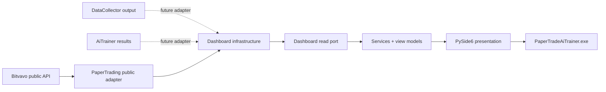

# Dashboard architecture

Dashboard contains no execution, model, collection, performance, or impact-score business
logic. Edge adapters translate bounded-context output into immutable view models. The current
live adapter is read-only and has no authenticated credentials or order capability.

Network refresh runs in Qt's worker pool. A timer controls rendering separately from ingestion,
coalesces overlapping refreshes, and updates widgets via a signal. Future history queries must
remain paginated/windowed.

Decision output, confidence, input state, feature importance, and explanation are distinct
optional values and must never be inferred. Post-event movement is an observed association,
not proof of causality.
